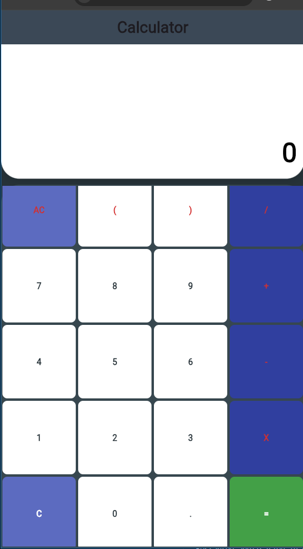

samples, guidance on mobile development, and a full API reference.

# Flutter Calculator

A beautiful, responsive calculator app built with Flutter. Supports both button and keyboard input, with a modern UI and smooth experience.



## Features
- Basic arithmetic operations (+, -, ×, ÷)
- Parentheses and decimal support
- AC (clear all), C (backspace), and = (evaluate)
- Keyboard input support
- Responsive, modern UI
- Works on mobile, desktop, and web

## Getting Started

1. **Clone the repository:**
	```sh
	git clone https://github.com/deba75/calculator.git
	cd calculator
	```
2. **Install dependencies:**
	```sh
	flutter pub get
	```
3. **Run the app:**
	```sh
	flutter run
	```

## Screenshot


---

Made with Flutter.
